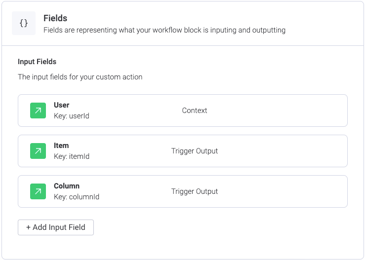
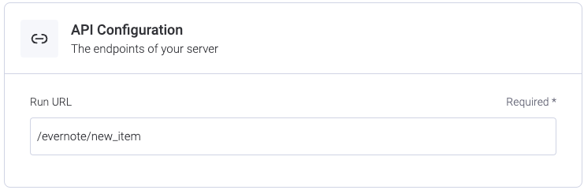

## Overview

This is a monday integration which joins a board with Evernote when a item changes. Right now the only
information sent is the status of the item, which is the expected column to change. <br>

**IMPORTANT**: This app needs an API key for Evernote with FULL access permissions, NOT basic access.

## Install

1. Make sure you have Node (v10+) and npm installed

2. Use the correct node version:

```
$ nvm use
```

<br>
3. Run node modules install:

```
$ npm install
```

You will also need to add your monday signing secret and evernote api key to the `.env` file.
## Run the project

1. Run the server with the command:

```
$ npm start
```

## Monday Action

You'll need to create the companion *Monday.com* action as well. For this, create an app
feature for integration, and add a new action in the *Workflow Blocks* option with this data:

* Input fields:
* Sentence: no sentence fields are used so just add the text `write a new note.`.
* Api Configuration:

After this just add a new recipe which uses this action and a trigger you'd need. The code of
the current app, as mentioned previously, expects a `status` column change and retrieves it from
the item data in file `src/controllers/monday-controller.js` at line `39`. You can modify this code 
to retrieve different data.
